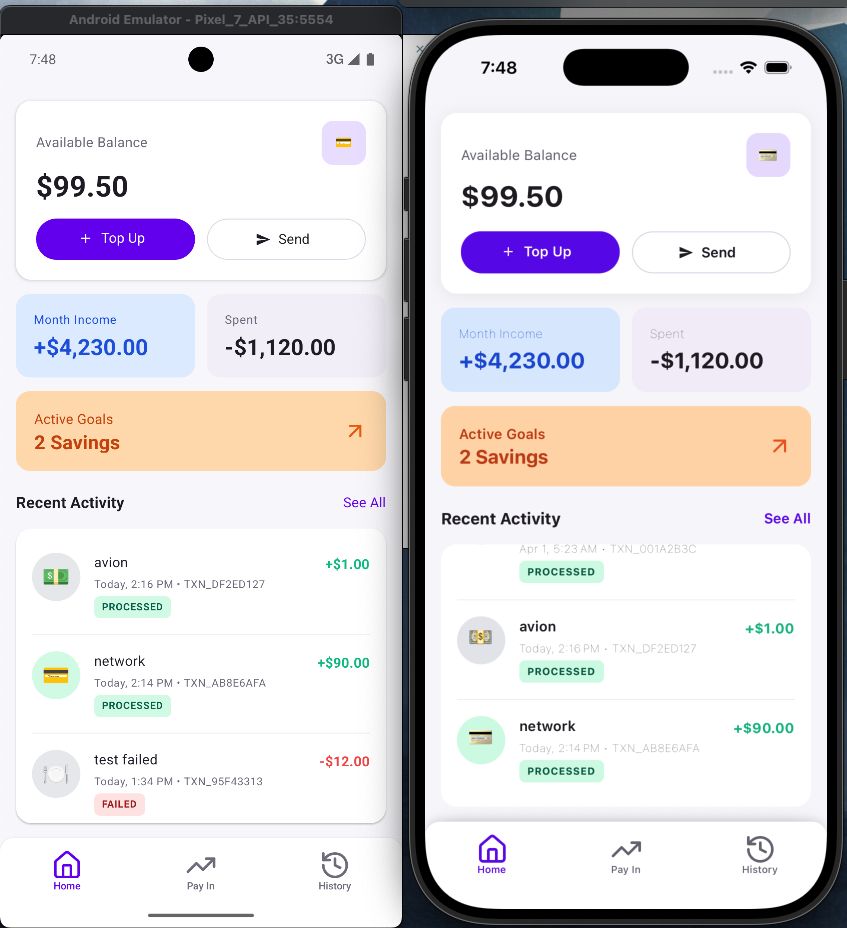
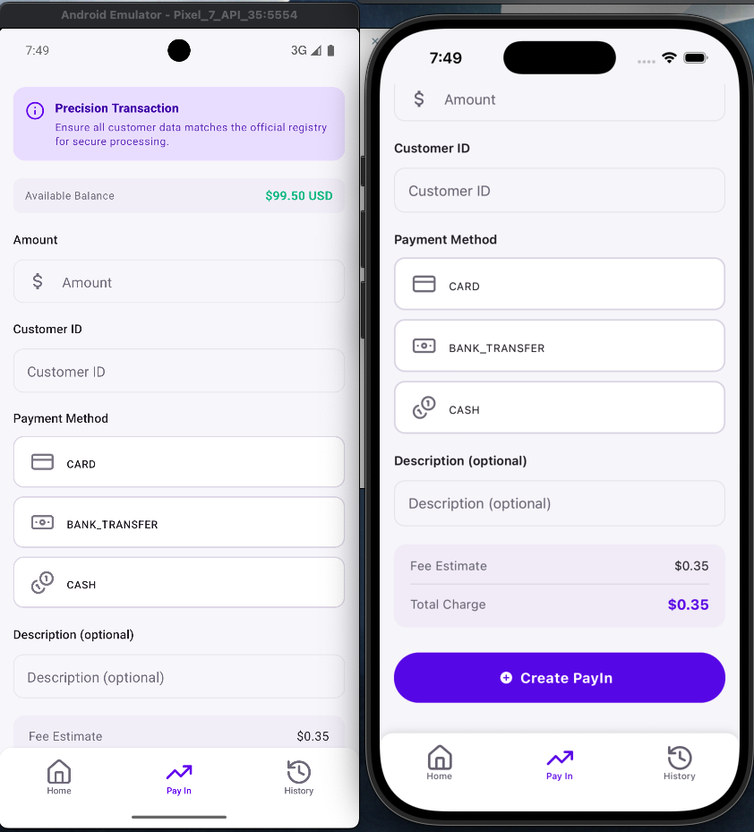
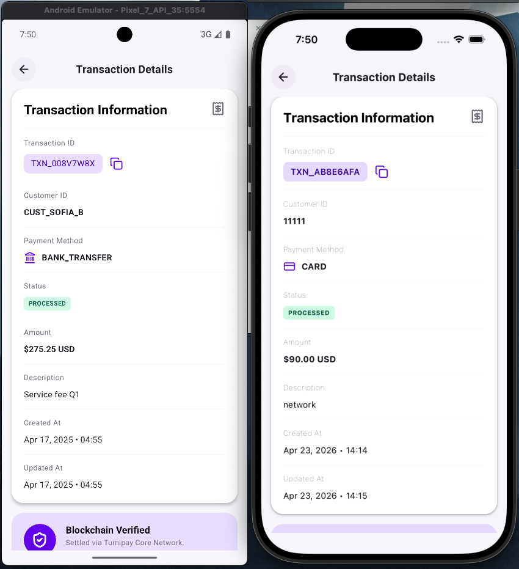

# TumiPay — React Native Mobile Technical Assessment

## Table of Contents

- [Overview](#overview)
- [Security Architecture](#security-architecture)
  - [Assumptions](#assumptions)
  - [Implemented](#implemented)
  - [Recommended Improvements](#recommended-improvements)
  - [Identified Risks](#identified-risks)
- [Architecture Diagrams](#architecture-diagrams)
- [State Management](#state-management)
- [Error Handling](#error-handling)
- [Stack](#stack)
- [Setup](#setup)
  - [Backend](#backend)
  - [Frontend](#frontend)
  - [Other Commands](#other-commands)
- [Project Structure](#project-structure)
- [Demo & Screenshots](#demo--screenshots)
- [Unit Test Report](#unit-test-report)
- [CI/CD Pipeline](#cicd-pipeline)
  - [Pipeline Stages](#pipeline-stages)

---

## Overview

TumiPay is a mobile wallet simulation built with React Native that enables users to create and manage PayIn transactions with full offline-first support. The application handles real-time payment processing when connectivity is available, and transparently enqueues pending requests when the device is offline — automatically flushing the queue once the connection is restored. Users can monitor their balance, income, and expenses at a glance, browse a paginated transaction history, and drill into individual transaction details by ID. The core feature set covers PayIn creation with form validation powered by `react-hook-form` and `Zod`, transaction listing and filtering, local data persistence via `NitroSQLite` for offline backup and cache, and a global toast notification system for user feedback and error handling.

---

## Security Architecture

### Assumptions

1. A proper onboarding flow has been completed, granting the application legitimate access to the user's personal information and the encryption artifacts generated during that process.

2. The backend does not currently issue encryption keys, so the client is responsible for generating and managing the cryptographic material used to sign and encrypt transactions.

3. The full transaction history is persisted in SQLite as an offline backup. The offline queue supports up to one pending PayIn request at a time, which is flushed automatically upon connectivity restoration.

### Implemented

1. **RSA + AES-GCM hybrid encryption** — On first launch the app generates an RSA key pair. The public key is transmitted over HTTPS to establish a secure channel between the client and the backend, mitigating man-in-the-middle attacks. The symmetric session secret is subsequently encrypted using AES-GCM before being written to local storage, ensuring the raw key is never persisted in plaintext.

2. **Request payload encryption** — Every outbound request includes the device's public key in its headers. Transaction payloads are encrypted prior to transmission so the backend can verify and decrypt them on arrival. ⚠️ _Note: in a production architecture this flow should be inverted — the server holds the private keys and clients encrypt against the server's public key._

### Recommended Improvements

1. **Hardware-bound device attestation** — Integrating a service such as Firebase App Check would bind each session to a verified device ID registered in the backend database. Because device IDs cannot be rotated as easily as IP addresses, this significantly raises the cost of scripted or DDoS attacks originating from unregistered clients.

2. **SSL/TLS certificate pinning** — Pinning the server's certificate or public key within the app bundle would prevent traffic interception even when the device operates behind a compromised or malicious proxy.

### Identified Risks

1. **Malicious packages in the dependency tree** — Third-party npm packages can ship with harmful postinstall scripts. To mitigate this, `pnpm` is used as the package manager with the `--ignore-scripts` flag enforced when adding new dependencies, preventing arbitrary scripts from executing in development environments.

2. **Client–server communication interception** — Network traffic between the client and the API is a viable attack surface. All sensitive data must be encrypted at the application layer in addition to relying on transport-level TLS, so that intercepted payloads remain opaque to an attacker.

3. **Binary reverse engineering** — Compiled `.aab` and `.ipa` artifacts can be unpacked and decompiled. Code obfuscation should be applied as part of the release build pipeline to raise the difficulty of extracting business logic, cryptographic constants, or API endpoints from the binary.

4. **API abuse and DDoS exposure** — Without server-side client verification, the API is exposed to both abusive usage and volumetric attacks. The client should supply credentials that prove it is a legitimate, registered device — a problem best addressed in combination with the hardware-bound attestation mechanism described above.

## Architecture Diagrams

|      **Clean Architecture** _(Ports & Adapters)_      |          **PayIn Transaction Flow**           |
| :---------------------------------------------------: | :-------------------------------------------: |
|  |  |

---

## State Management

Three complementary layers handle state at different scopes and lifetimes:

| Tool            | Scope                 | Persistence           | Used for                                  |
| --------------- | --------------------- | --------------------- | ----------------------------------------- |
| **Zustand**     | Global / cross-screen | Via `zustand/persist` | Offline queue, user information           |
| **MMKV**        | Disk                  | Native key-value      | Device credentials, balance, queue backup |
| **NitroSQLite** | Disk                  | Relational            | Full transaction history cache            |

Zustand was chosen over Redux for its minimal boilerplate and first-class support for the `persist` middleware, which made the offline queue trivial to back with MMKV. React Context was ruled out for anything involving frequent writes — balance updates and queue mutations — to avoid unnecessary re-renders across the tree. AsyncStorage was ruled out in favour of MMKV due to its synchronous reads and significantly better performance on large serialized payloads.

---

## Error Handling

Errors are caught and normalized at three boundaries:

1. **Axios interceptors (`error.interceptor.ts`)** — All HTTP responses with non-2xx status codes are intercepted before reaching the repository layer. The interceptor normalizes API error shapes into a consistent `Error` instance so use cases never need to handle raw Axios errors.

2. **Use case boundary** — Each use case wraps its I/O in a `try/catch`. Failures propagate upward as typed errors, keeping the presentation layer unaware of whether the failure originated from the network, the local cache, or the crypto layer.

3. **Presentation layer (`usePayInForm`)** — The hook catches errors thrown by `createPayIn.execute()`, closes the processing modal, and surfaces a descriptive message via the global toast system. The local SQLite cache and MMKV balance are only written on confirmed success, so a failed request leaves no inconsistent local state.

The offline queue follows a separate error path: if `processOfflineQueueUseCase` fails on retry, the item remains in the queue and the processor can attempt again on the next connectivity event.

# Stack

[](https://reactnative.dev/)
[](https://react.dev/)
[](https://react-hook-form.com/)
[](https://zod.dev/)
[](https://zustand-demo.pmnd.rs/)
[](https://reactnavigation.org/)
[](https://callstack.github.io/react-native-paper/)
[](https://github.com/mrousavy/react-native-mmkv)
[](https://axios-http.com/)
[](https://github.com/software-mansion/react-native-svg)
[](https://github.com/th3rdwave/react-native-safe-area-context)
[](https://github.com/software-mansion/react-native-screens)
[](https://lucide.dev/)
[](https://github.com/react-native-netinfo/react-native-netinfo)
[](https://github.com/react-native-clipboard/clipboard)

# Setup

1. Rename `.env.example` to `.env`:

```bash
cp .env.example .env
```

Or manually rename the file from `.env.example` to `.env`

2. Install all dependencies with:

```bash
pnpm run install-secure
```

## Backend

3. Run backend with dummy data(json-server):

```bash
pnpm run backend
```

## Frontend

4. Install iOS pods using the custom script:

```bash
pnpm run ios-preBuild
```

5. Run Metro in another terminal tab (Optional):

```bash
pnpm start
```

6. Run in iOS simulator. You can also open Xcode and run 2 different schemas (Debug or Release). With this command you can run in debug mode:

```bash
pnpm run ios
```

Or use the custom simulator configuration:

```bash
pnpm run ios-custom
```

7. Run in Android simulator:

```bash
pnpm run android
```

8. If you want to run unit tests with coverage, use this command (optional):

```bash
pnpm run test
```

If you have any problems, these are my actual global versions:

```bash
node -v                -> v24.15.0
pnpm -v                -> (your version)
npx metro --version    -> 0.81.5
```

### Other commands:

1. Clean Android build:

```bash
pnpm run android-clean
```

2. Clean iOS build:

```bash
pnpm run ios-clean
```

3. Reset Metro cache:

```bash
pnpm run reset-cache
```

# Command tree for the files

```bash
src
├── application                          # Application layer: orchestrates use cases and defines contracts
│   ├── index.ts
│   ├── repositories                     # Interfaces (contracts) that define what data operations are needed
│   │   ├── IDeviceCredentialRepository.ts
│   │   ├── index.ts
│   │   ├── IPayInRepository.ts
│   │   ├── ITransactionCacheRepository.ts
│   │   └── IUserInformationRepository.ts
│   ├── services                         # Interfaces for external services — keeps the app layer decoupled
│   │   ├── ICryptoService.ts
│   │   └── index.ts
│   └── useCases                         # Business logic: each use case represents a single user action
│       ├── index.ts
│       ├── initDeviceCredential         # Use case: initializes device credentials (key pair generation, storage)
│       │   ├── __test__
│       │   │   └── initDeviceCredentialUseCase.test.ts
│       │   ├── index.ts
│       │   └── initDeviceCredentialUseCase.ts
│       └── payIn                        # Use cases related to payment ingestion: create, retrieve, list, and process offline payments
│           ├── __test__
│           │   └── processofflinequeueusecase.test.ts
│           ├── createPayInUseCase.ts
│           ├── getPayInUseCase.ts
│           ├── index.ts
│           ├── listPayInsUseCase.ts
│           ├── listTransactionsUseCase.ts
│           └── processOfflineQueueUseCase.ts  # Handles retrying queued transactions when connectivity is restored
│
├── domain                               # Domain layer: core business rules, entities, and value objects — has zero external dependencies
│   ├── entities                         # Core business objects with identity and lifecycle (PayIn, Transaction, etc.)
│   │   ├── deviceCredential.ts
│   │   ├── index.ts
│   │   ├── payIn.ts
│   │   ├── transactionRecord.ts
│   │   └── userInformation.ts
│   ├── index.ts
│   ├── mappers                          # Transforms raw data (DTOs, API responses) into domain entities and vice versa
│   │   ├── index.ts
│   │   └── payInMapper.ts
│   └── value-objects                    # Immutable objects representing domain concepts with no identity (Amount, KeyPair, DTOs)
│       ├── amount.ts
│       ├── CreatePayInDTO.ts
│       ├── index.ts
│       ├── keyPair.ts
│       └── payInDTO.ts
│
├── index.ts
│
├── infrastructure                       # Infrastructure layer: concrete implementations of interfaces (HTTP, storage, DI container)
│   ├── di                               # Dependency injection container — wires up all repositories, services and use cases at startup
│   │   ├── container.ts
│   │   └── index.ts
│   ├── http                             # Everything related to outbound HTTP communication
│   │   ├── client                       # Configured Axios HTTP client instance
│   │   │   ├── index.ts
│   │   │   └── tumiPayClient.ts
│   │   ├── createClient.ts
│   │   ├── index.ts
│   │   ├── interceptors                 # Axios interceptors for cross-cutting concerns: auth headers, error handling, logging
│   │   │   ├── __test__
│   │   │   │   └── auth.interceptor.test.ts
│   │   │   ├── auth.interceptor.ts      # Attaches device credentials / signed tokens to outgoing requests
│   │   │   ├── error.interceptor.ts     # Normalizes API errors into domain-friendly formats
│   │   │   └── logger.interceptor.ts    # Logs requests and responses for debugging
│   │   ├── interfaces
│   │   │   └── axios.d.ts               # Type augmentation for Axios (custom config fields, etc.)
│   │   └── services
│   │       ├── __test__
│   │       │   └── CryptoService.test.ts
│   │       ├── CryptoService.ts         # Concrete crypto implementation (RSA/AES signing and encryption)
│   │       ├── index.ts
│   │       └── payInHttpRepository.ts   # Implements IPayInRepository using the HTTP client
│   ├── index.ts
│   └── storage                          # Local persistence strategies
│       ├── index.ts
│       ├── interfaces
│       │   └── env.d.ts                 # Type definitions for environment variables
│       ├── mmkv                         # Fast key-value storage for small data (credentials, user info, offline queue)
│       │   ├── __mocks__                # Test mocks for MMKV to avoid native module dependencies in Jest
│       │   │   ├── index.ts
│       │   │   └── mmkvStorage.ts
│       │   ├── index.ts
│       │   ├── manager                  # High-level typed managers on top of raw MMKV storage
│       │   │   ├── __tests__
│       │   │   │   └── userInformationStorage.test.ts
│       │   │   ├── deviceCredentialStorage.ts
│       │   │   ├── index.ts
│       │   │   ├── interfaces           # Typed schemas for each stored entity
│       │   │   │   ├── deviceCredential.ts
│       │   │   │   ├── index.ts
│       │   │   │   ├── offlineQueue.ts
│       │   │   │   └── userInformation.ts
│       │   │   ├── offlineQueueStorage.ts   # Persists failed transactions to be retried when back online
│       │   │   └── userInformationStorage.ts
│       │   ├── mmkvStorage.ts           # Low-level MMKV wrapper
│       │   └── repositories             # Implements domain repository interfaces using MMKV
│       │       ├── deviceCredentialRepository.ts
│       │       ├── index.ts
│       │       └── userInformationRepository.ts
│       └── sqlite                       # SQLite storage for structured/relational data (transaction cache)
│           ├── __test__
│           │   └── nitroSQLiteDb.test.ts
│           ├── index.ts
│           ├── nitroSQLiteDb.ts         # SQLite database initialization and connection via NitroSQLite
│           └── repositories
│               ├── __test__
│               │   └── transactionCacheRepository.test.ts
│               ├── index.ts
│               └── transactionCacheRepository.ts  # Implements ITransactionCacheRepository using SQLite
│
├── presentation                         # Presentation layer: UI components, screens, hooks, and navigation — consumes use cases via DI
│   ├── components
│   │   ├── home                         # Reusable UI components scoped to the Home screen
│   │   │   ├── ActiveGoalsCard.tsx
│   │   │   ├── BalanceCard.tsx
│   │   │   ├── index.ts
│   │   │   ├── PayInSnackbar.tsx
│   │   │   ├── RecentActivity.tsx
│   │   │   ├── StatusBadge.tsx
│   │   │   └── SummaryRow.tsx
│   │   ├── index.ts
│   │   ├── payIn                        # Reusable UI components scoped to the PayIn flow
│   │   │   ├── index.ts
│   │   │   ├── PayInResultModal.tsx
│   │   │   ├── PayInSummaryCard.tsx
│   │   │   └── PaymentMethodSelector.tsx
│   │   └── transactionHistory           # Components for displaying transaction detail views
│   │       ├── Blockchainverifiedcard.tsx
│   │       ├── index.ts
│   │       └── Transactioninfocard.tsx
│   ├── hooks
│   │   ├── home
│   │   ├── index.ts
│   │   ├── payIn                        # Custom hooks encapsulating PayIn form state and submission logic
│   │   │   ├── __test__
│   │   │   │   └── usePayInForm.test.ts
│   │   │   ├── index.ts
│   │   │   └── usePayInForm.ts
│   │   ├── transactionHistory           # Hooks for fetching and formatting transaction lists and details
│   │   │   ├── index.ts
│   │   │   ├── usetransactiondetails.ts
│   │   │   └── usetransactionhistory.ts
│   │   └── useOfflineQueueProcessor.ts  # Hook that triggers offline queue retry when internet is restored
│   ├── index.ts
│   ├── navigation                       # App navigation structure (tab navigator, stack routes, route name constants)
│   │   ├── index.ts
│   │   ├── MainNavigation.tsx
│   │   ├── navigations.ts
│   │   └── NavigationTab.tsx
│   └── screens                          # Full-page screen components — composed from components and driven by hooks
│       ├── home
│       │   ├── home.strings.ts          # Localized/static strings for the Home screen
│       │   ├── HomeScreen.tsx
│       │   └── index.ts
│       ├── index.ts
│       ├── payIn
│       │   ├── index.ts
│       │   ├── payIn.string.ts
│       │   └── PayInScreen.tsx
│       └── transactionHistory
│           ├── index.ts
│           ├── transactiondetails.strings.ts
│           ├── TransactionDetailsScreen.tsx
│           ├── transactionhistory.strings.ts
│           └── TransactionHistoryScreen.tsx
│
└── shared                               # Shared utilities, components, and assets used across all layers
    ├── __mocks__
    │   └── env.ts                       # Mock environment variables for unit tests
    ├── assets                           # Static image assets (screenshots, icons, etc.)
    │   ├── Screenshot1.png
    │   ├── Screenshot2.png
    │   ├── Screenshot3.png
    │   └── Screenshot4.png
    ├── components                       # Truly generic UI components with no feature coupling (inputs, modals, toasts, etc.)
    │   ├── __test__
    │   │   └── InputGeneric.test.tsx
    │   ├── EmptyState.tsx
    │   ├── ErrorState.tsx
    │   ├── index.ts
    │   ├── InputGeneric.tsx
    │   ├── interfaces
    │   │   ├── index.ts
    │   │   ├── InputGeneric.ts
    │   │   ├── Portals.ts
    │   │   └── TextGeneric.ts
    │   ├── modal                        # Portal-based modal system for rendering overlays outside the component tree
    │   │   ├── index.ts
    │   │   ├── Modal.tsx
    │   │   ├── Portal.tsx
    │   │   └── PortalProvider.tsx
    │   ├── OfflineBanner.tsx            # Global banner displayed when the device has no internet connectivity
    │   ├── StandardWrapper.tsx
    │   ├── TextGeneric.tsx
    │   ├── toast                        # In-app toast notification system
    │   │   ├── Apptoast.tsx
    │   │   ├── index.ts
    │   │   └── toast.strings.ts
    │   └── TransactionItem.tsx          # Reusable list item component for rendering a single transaction
    ├── crypto                           # Low-level cryptographic primitives (AES-GCM encryption, RSA signing)
    │   ├── aes-gcm.ts
    │   └── rsa.ts
    ├── hooks
    │   ├── __test__
    │   │   └── useInternetStatus.test.ts
    │   ├── index.ts
    │   └── useInternetStatus.ts         # Hook that monitors network connectivity status in real time
    ├── index.ts
    ├── theme                            # Design system: color palette, spacing, typography, and theme config
    │   ├── colors.ts
    │   ├── index.ts
    │   └── theme.ts
    └── utils                            # Pure utility functions with no side effects
        ├── __test__
        │   └── formatDate.test.ts
        ├── constants
        │   ├── index.ts
        │   └── phoneDimensions.ts       # Device screen dimension constants (useful for responsive layouts)
        ├── formatAmount.ts              # Formats numeric amounts for display (currency formatting, decimals)
        ├── formatDate.ts                # Formats date strings/objects into human-readable representations
        ├── generateUuid.ts              # Generates unique identifiers for entities and transactions
        ├── index.ts
        └── isIOS.ts                     # Platform detection utility

64 directories, 155 files
```

## Link-video-demo-app

[](https://youtu.be/zuM7Cxp1hRM)

## App Screenshots

|         |                 Mobile                 |
| :-----: | :------------------------------------: |
|  Home   |  |
|  PayIn  |  |
| History |  |
| Details |  |

## Unit Test Report

```bash
--------------------------------------------|---------|----------|---------|---------|-------------------
File                                        | % Stmts | % Branch | % Funcs | % Lines | Uncovered Line #s
--------------------------------------------|---------|----------|---------|---------|-------------------
All files                                   |   98.38 |    90.66 |   98.07 |   98.33 |
 application/useCases/initDeviceCredential  |     100 |      100 |     100 |     100 |
  initDeviceCredentialUseCase.ts            |     100 |      100 |     100 |     100 |
 application/useCases/payIn                 |     100 |      100 |     100 |     100 |
  processOfflineQueueUseCase.ts             |     100 |      100 |     100 |     100 |
 infrastructure/http/interceptors           |     100 |      100 |     100 |     100 |
  auth.interceptor.ts                       |     100 |      100 |     100 |     100 |
 infrastructure/http/services               |     100 |      100 |     100 |     100 |
  CryptoService.ts                          |     100 |      100 |     100 |     100 |
 infrastructure/storage/mmkv/manager        |     100 |      100 |     100 |     100 |
  userInformationStorage.ts                 |     100 |      100 |     100 |     100 |
 infrastructure/storage/sqlite              |   94.44 |     87.5 |     100 |   94.11 |
  nitroSQLiteDb.ts                          |   94.44 |     87.5 |     100 |   94.11 | 39
 infrastructure/storage/sqlite/repositories |     100 |    88.88 |     100 |     100 |
  index.ts                                  |       0 |        0 |       0 |       0 |
  transactionCacheRepository.ts             |     100 |    88.88 |     100 |     100 | 82,96
 presentation/hooks/payIn                   |     100 |     87.5 |     100 |     100 |
  usePayInForm.ts                           |     100 |     87.5 |     100 |     100 | 18-19
 shared/components                          |   66.66 |     87.5 |      75 |   66.66 |
  InputGeneric.tsx                          |   66.66 |     87.5 |      75 |   66.66 | 63-64
 shared/hooks                               |     100 |      100 |     100 |     100 |
  useInternetStatus.ts                      |     100 |      100 |     100 |     100 |
 shared/utils                               |     100 |      100 |     100 |     100 |
  formatDate.ts                             |     100 |      100 |     100 |     100 |
--------------------------------------------|---------|----------|---------|---------|-------------------

Test Suites: 11 passed, 11 total
Tests:       167 passed, 167 total
Snapshots:   0 total
Time:        3.954 s
```

## CI/CD Pipeline

The pipeline is implemented with **GitHub Actions** and runs automatically on every push or pull request targeting `master`.

### Pipeline Stages

install → lint → test → build-android → build-ios → deploy
